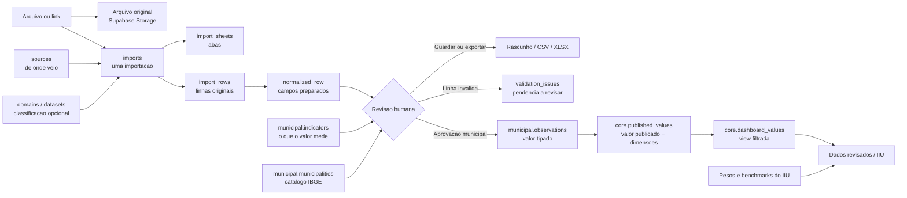
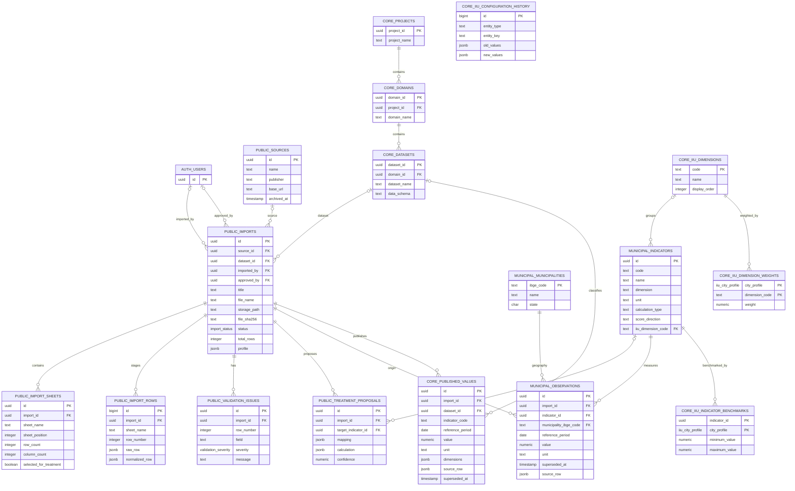

# DECSYS - handoff tecnico

Este arquivo descreve a arquitetura implementada, os fluxos de dados, a configuracao local e os limites conhecidos do DECSYS para orientar desenvolvimento e manutencao.

## Estado e escopo

O DECSYS e uma aplicacao interna para importar arquivos tabulares, revisar sua leitura, preservar a origem e preparar dados de indicadores urbanos. O fluxo municipal pode publicar observacoes aprovadas e alimentar a pagina do Indice de Inteligencia Urbana (IIU).

A ingestao e relativamente generica: linhas de formatos e dominios diferentes podem ser armazenadas como JSON por importacao/aba. A publicacao final e o dashboard ainda sao especificos ao modelo municipal e ao catalogo `municipal.indicators`. O projeto nao oferece, neste momento, um construtor de dashboards arbitrarios para todo dominio nem uma camada generica de calculo de indicadores.

## Arquitetura

```text
Browser (Next.js)
  -> Next.js Route Handlers (/api/*)
  -> FastAPI (servico de ingestao, porta 8000)
  -> Supabase REST / Storage
  -> PostgreSQL: public, core e municipal

FastAPI -> Gemini ou OpenAI (avaliacao opcional de amostra)
FastAPI -> fontes publicas (download de arquivos e catalogo IBGE)
```

### Fluxo ponta a ponta

```mermaid
flowchart TD
    A[Pessoa escolhe arquivo ou link] --> B[Next.js: tela de importacao]
    B --> C[Next.js Route Handler /api/*]
    C --> D[FastAPI: perfil e leitura estrutural]
    D --> E{Leitura valida?}
    E -- nao --> F[Erro de formato, download ou leitura]
    E -- sim --> G[Previa: abas, colunas, tipos, linhas e avisos]
    G --> H[Cache temporario em memoria: upload_token]
    H --> I[Pessoa escolhe aba(s) e salva importacao]
    I --> J[Supabase Storage: arquivo original]
    I --> K[PostgreSQL: sources e imports]
    I --> L[PostgreSQL: import_sheets e import_rows]
    L --> M{Destino escolhido}
    M -- exportar --> N[CSV ou XLSX]
    M -- guardar/revisar --> O[Rascunho com linhas cruas e proveniencia]
    M -- aprovar genericamente --> P[treatment_proposal + status approved]
    P --> Q[Sem valores publicados automaticamente]
    M -- painel municipal --> R[Mapear indicador, municipio, periodo, valor e unidade]
    R --> S[Normalizar e validar linhas]
    S --> T{Linha municipal valida?}
    T -- nao --> U[validation_issues / fica fora da publicacao]
    T -- sim --> V[municipal.observations]
    V --> W[core.published_values]
    W --> X[core.dashboard_values]
    X --> Y[Dados revisados e calculo IIU]
```

O ramo de aprovacao municipal e o unico fluxo descrito acima que materializa valores em `core.published_values`. A aprovacao generica guarda a proposta do mapeamento e muda o estado, mas nao cria esses valores.

| Camada | Responsabilidade |
| --- | --- |
| `src/app` | Paginas Next.js, componentes React e Route Handlers usados pelo browser. |
| `src/lib` | Tipos e utilitarios compartilhados; `ingestion-proxy.ts` centraliza a chamada Next -> FastAPI. |
| `services/ingestion/app/main.py` | API FastAPI: leitura, perfilamento, sugestoes, transformacoes, validacao e acesso ao Supabase. |
| `supabase/migrations` | Historico incremental de schema, funcoes SQL, views, politicas e dados iniciais. |
| Supabase Storage | Bucket privado `source-files` para arquivos originais. |

As chamadas do browser vao primeiro para Route Handlers Next. Esses handlers encaminham requests para FastAPI usando `INGESTION_API_URL`, com timeout e adaptacao de erros. FastAPI chama Supabase REST/PostgREST com `SUPABASE_SERVICE_ROLE_KEY`; a chave nao deve ser enviada ao browser.

## Fluxo de importacao

1. `POST /api/import-preview` encaminha o arquivo para `POST /profile`. FastAPI le e perfila a fonte, devolve colunas, tipos, linhas de amostra, contagens, sugestoes, avisos e um `upload_token`.
2. O conteudo fica em cache de memoria no processo FastAPI por ate duas horas. O token permite trocar de aba e depois criar o rascunho sem reenviar o arquivo. Reiniciar o processo perde esse cache; o token nao e armazenamento persistente.
3. `POST /api/import-draft` ou `/api/import-draft-link` chama `POST /imports/draft` ou `/imports/draft-link`. FastAPI grava o original no bucket privado, cria `sources`/`imports`, registra abas em `import_sheets` e linhas em `import_rows` em lotes.
4. Para XLSX, a importacao pode incluir a aba escolhida ou todas as abas. Cada linha conserva `raw_row` em JSONB; as preparacoes escrevem campos em `normalized_row`, sem substituir o registro de origem.
5. Para publicacao municipal, a pessoa escolhe indicador, campos e periodo. O servico resolve/valida codigos IBGE, converte valores e periodos e pode gerar uma previa de calculo. A aprovacao SQL grava somente linhas validas e registra problemas em `validation_issues`.
6. A aprovacao municipal escreve `municipal.observations` e `core.published_values`. `core.dashboard_values` expoe valores ativos cuja importacao esta aprovada e nao arquivada.

### Diferenca entre aprovar importacao e publicar dados

- `POST /imports/{id}/approve` chama `approve_generic_import`: grava uma `treatment_proposal` e muda o estado da importacao para `approved`. Esta funcao, por si so, **nao cria** linhas em `core.published_values` e nao faz os valores aparecerem no dashboard.
- `POST /imports/{id}/approve-municipal` chama o fluxo municipal: valida municipio, periodo e valor, grava observacoes municipais e valores publicados.
- Portanto, nao interprete `imports.status = approved` isoladamente como prova de que aquela importacao alimenta o dashboard. Para valores municipais publicados, confirme `core.published_values` ou consulte `core.dashboard_values`.

Ao descartar, o endpoint remove o objeto do Storage e marca a importacao como `discarded`; nao executa hard delete geral da importacao. Linhas e metadados podem permanecer para historico. Descartar uma importacao nao deve ser tratado como mecanismo de reversao dos valores ja publicados.

## Modelo de dados

| Tabela/view | Uso |
| --- | --- |
| `public.sources` | Publicador ou origem associada a importacoes. |
| `public.imports` | Uma execucao de importacao: estado, arquivo, URL, fonte e `dataset_id`. Estados incluem `draft`, `analyzing`, `needs_review`, `approved`, `archived` e `discarded`. |
| `public.import_sheets` | Perfil, posicao e selecao de cada aba de um workbook. |
| `public.import_rows` | Linhas staged; `raw_row` preserva a linha original e `normalized_row` guarda preparacao. |
| `public.validation_issues` | Erros e pendencias associados a importacao e linha/campo. |
| `public.treatment_proposals` | Mapeamento/explicacao da aprovacao generica. Nao e tabela de valores publicada. |
| `core.projects`, `core.domains`, `core.datasets` | Organizacao logica de dados por projeto, dominio e conjunto de dados. |
| `municipal.municipalities` | Catalogo municipal, incluindo codigo IBGE. |
| `municipal.indicators` | Catalogo de indicadores atualmente usado pelo fluxo municipal e IIU. |
| `municipal.observations` | Observacoes municipais aprovadas, com periodo, valor e linha fonte. |
| `core.published_values` | Representacao consultavel dos valores publicados com dimensoes JSONB, indicador, unidade, periodo e proveniencia. |
| `core.dashboard_values` | View filtrada para valores nao superseded de importacoes aprovadas e nao arquivadas. |
| `core.iiu_dimensions`, `core.iiu_dimension_weights`, `core.iiu_indicator_benchmarks` | Dimensoes, pesos por porte e faixas de benchmark do IIU. |
| `core.iiu_configuration_history` | Auditoria de mudancas em configuracoes do IIU e campos de calculo dos indicadores. |

O banco e compartilhado; nao se cria um banco por dashboard. `domain_id`/`dataset_id` ajudam a organizar e filtrar fontes, mas nao tornam o significado de cada campo universal. A aprovacao atual tem FK/modelo municipal e exige codigo de municipio. Um dominio novo, como veiculos eletricos, pode ser importado e preservado como linhas cruas, mas requer modelagem de indicador/publicacao/consulta antes de alimentar seu proprio dashboard.

### Visao simplificada: onde os dados ficam



Leia o desenho assim:

- **Importacao e um envelope.** Cada arquivo/operacao tem seu proprio `imports.id`, estado, origem e arquivo original. Importar outra planilha cria outra importacao; os dados nao se juntam automaticamente.
- **Abas e linhas sao a materia-prima.** `import_sheets` descreve as abas; `import_rows.raw_row` preserva cada linha como veio. `normalized_row` guarda os campos derivados para revisao/publicacao.
- **Indicador define significado, nao guarda o valor.** `municipal.indicators` descreve nome, unidade, dimensao e regra; `municipal.observations`/`core.published_values` guardam os valores para um municipio e periodo.
- **Pendencia nao e valor publicado.** Linhas invalidas ficam fora da aprovacao e geram `validation_issues`. Linhas brutas continuam ligadas ao import para rastreabilidade.
- **O dashboard le a camada publicada.** `core.dashboard_values` filtra os valores publicados ativos de importacoes aprovadas e nao arquivadas; o dashboard nao deve ler rascunhos diretamente.
- **Configuracao do IIU fica separada dos dados.** Pesos e benchmarks alteram como valores publicados viram scores. Mudar peso/faixa nao altera a planilha original nem exige reimportar os valores.

Exemplo conceitual: a planilha de PIB per capita de Campinas em 2023 continua preservada na importacao e na linha de origem. Depois de associada ao indicador `PIB per capita`, validada para o municipio IBGE `3509502` e aprovada, o valor publicado referencia o indicador, a dimensao geografica, o periodo `2023-01-01`, a unidade e a importacao fonte. O IIU usa essa observacao somente se o indicador fizer parte da configuracao do indice e houver regra/benchmark valido.

### Modelo relacional

O diagrama mostra as tabelas persistentes e suas FKs principais. Os nomes foram prefixados pelo schema para facilitar a leitura; por exemplo, `CORE_DATASETS` representa `core.datasets` e `MUNICIPAL_INDICATORS` representa `municipal.indicators`.



`CORE_IIU_CONFIGURATION_HISTORY.entity_key` e polimorfico e nao tem FK para uma tabela especifica. `core.dashboard_values`, `public.dashboard_values` e os catalogos `public.iiu_*` sao views, nao tabelas-base, por isso nao aparecem como entidades armazenadoras no ERD. O bucket `source-files` tambem e Storage, nao uma tabela SQL.

### Como uma linha muda ao longo do fluxo

Uma linha em `public.import_rows` e isolada por importacao, aba e numero de linha. Exemplo simplificado:

```json
{
  "raw_row": {
    "Municipio": "Campinas (SP)",
    "Ano": "2023",
    "PIB per capita": "55.234,75"
  },
  "normalized_row": {
    "municipality_ibge_code": "3509502",
    "reference_year": "2023",
    "reference_period": "2023-01-01",
    "value": "55234.75"
  }
}
```

Os nomes acima ilustram o formato; a normalizacao concreta depende dos campos que a pessoa seleciona. A linha publicada e uma linha relacional em `core.published_values`: `indicator_code`, `reference_period`, `value`, `unit` e `dimensions`, por exemplo `{ "municipality_ibge_code": "3509502", "geography_level": "municipality" }`. `source_row` conserva a proveniencia usada para produzir o valor.

Importante para extensoes: `core.published_values.indicator_code` e texto e nao possui FK para `municipal.indicators`. A integridade do indicador e garantida no fluxo municipal antes da publicacao; a tabela de valores, sozinha, nao valida um codigo contra o catalogo. `dimensions` e JSONB, portanto a granularidade geografica/dominal tambem precisa ser validada e filtrada pela aplicacao.

### Migrations

As migrations existentes vao de `0001_initial.sql` a `0023_iiu_thesis_model.sql` (a 0020 cadastra os 102 indicadores da matriz de coleta; a 0021/0022 guardam fontes de coleta editáveis; a 0023 troca o modelo do IIU pelas 7 dimensões da tese e arquiva o modelo antigo em `core.iiu_legacy_snapshot`). Em banco existente, aplique somente migrations ainda nao executadas, na ordem; nao reaplique scripts manualmente sem conferir o estado do schema. `supabase/schema.sql` e uma definicao consolidada para referencia/instalacao, enquanto as migrations registram a evolucao incremental. O servico informa erros com o nome de algumas migrations se uma funcao ou view necessaria estiver faltando.

## API principal

Os handlers web equivalentes ficam em `src/app/api`. Os endpoints FastAPI estao em `services/ingestion/app/main.py`.

| FastAPI | Funcao |
| --- | --- |
| `GET /health` | Liveness do processo, sem validar acesso ao Supabase. |
| `GET /keepalive` | Consulta pequena ao banco; requer `KEEPALIVE_SECRET` via Bearer. |
| `POST /profile`, `POST /profile-link` | Leitura estrutural de upload ou link. |
| `POST /imports/draft`, `POST /imports/draft-link` | Persistencia de um rascunho. |
| `GET /imports`, `GET /imports/{id}/resume` | Lista e retoma importacoes. |
| `GET /imports/{id}/sheets`, `POST /imports/{id}/include-sheets` | Metadados e inclusao de abas. |
| `POST /imports/{id}/municipality-matches`, `POST /imports/{id}/apply-municipality-matches` | Sugere e aplica resolucao de municipios. |
| `POST /imports/{id}/normalize-wide`, `POST /imports/{id}/normalize-municipal-wide`, `POST /imports/{id}/expand-periods` | Prepara formatos largos e periodos por coluna. |
| `POST /imports/{id}/municipal-preview`, `POST /imports/{id}/approve-municipal` | Previa e aprovacao municipal de um indicador. |
| `POST /imports/{id}/approve-municipal-batch` | Confere e grava varias medidas da mesma aba em uma unica importacao. |
| `POST /imports/{id}/approve`, `POST /imports/{id}/discard` | Aprovacao generica ou descarte da importacao. |
| `GET /imports/{id}/validation-issues`, `GET /imports/{id}/export.csv`, `GET /imports/{id}/export.xlsx` | Pendencias e exportacao. |
| `GET/POST /indicators`, `GET/PATCH /indicators/{id}`, `POST /indicators/{id}/deactivate` | Catalogo de indicadores. |
| `GET /dashboard-values` | Consulta paginada de valores publicados. |
| `GET /iiu-municipalities`, `GET /iiu-dashboard/{municipality_code}` | Busca de municipio e calculo do IIU. |
| `GET /iiu-configuration`, `PUT /iiu-configuration/weights`, `PUT /iiu-configuration/benchmark` | Consulta e configuracao do IIU. |

As paginas web principais sao `/` (inicio: como o fluxo funciona), `/coleta` (onde buscar cada indicador da matriz), `/importar` (nova importacao; aceita `?link=` para pre-preencher), `/importacoes`, `/dados-revisados`, `/indicadores`, `/indicadores/novo`, `/iiu` e `/iiu/configuracao`. O catalogo de coleta vive em `src/data/coleta/*.json`; `services/ingestion/tests/live_catalog_check.py` confere os links ao vivo.

## Leitura, normalizacao e IA

- Extensoes de tabela: CSV, XLSX, XLS e JSON. Tambem aceita ZIP/GZ que contenham um desses formatos. Um ZIP seleciona o primeiro membro compativel; nao e um seletor de varios arquivos internos.
- XLSX suporta perfil por aba, selecao de uma aba e inclusao de todas as abas.
- O parser tenta detectar separador/encoding CSV, decimal brasileiro e certos CSVs com registros encapsulados. XLSX tenta localizar cabecalhos mesmo com linhas de titulo e combina cabecalhos quando aplicavel.
- A leitura e deterministica; tipo e sugestao de mapeamento nao equivalem a validacao semantica. O perfil inclui amostra limitada (ate 20 linhas), colunas, tipos, nulos e recomendacoes.
- A avaliacao Gemini/OpenAI recebe o perfil/amostra, nao e um agente que navega livremente, e nunca aprova ou publica dados. Se a avaliacao falhar ou nao estiver configurada, o perfilamento estrutural continua.
- O limite padrao e 200 MB por arquivo (`MAX_SOURCE_MB`). Cache de upload em memoria: duas horas e 1 GB agregado (`SOURCE_CACHE_MB`); esses limites sao configuraveis no servico.

## IIU: comportamento implementado

`GET /iiu-dashboard/{codigo}` consulta catalogo de indicadores, pesos do porte, benchmarks e valores publicados para o municipio. Para cada indicador:

- `direct`: normaliza `(valor - minimo) / (maximo - minimo) * 100`;
- `inverse`: normaliza `(maximo - valor) / (maximo - minimo) * 100`;
- `checklist`: normaliza `valor / checklist_max * 100`.

Scores sao limitados a 0-100. A pontuacao da dimensao e a media aritmetica dos indicadores com score; a pontuacao geral e a media ponderada das dimensoes com score, renormalizando pelos pesos presentes. Sem benchmark/valor suficiente, o score fica ausente; ausencia nao equivale a zero. A demonstracao usa valores sinteticos e nao deve ser tratada como observacao oficial.

## Configuracao local

Requisitos: Node.js/npm, Python e acesso a um projeto Supabase. O projeto usa `pnpm-lock.yaml`, e os scripts PowerShell residem na raiz.

1. Aplique no Supabase as migrations pendentes em `supabase/migrations`, na ordem numerica.
2. Crie `services/ingestion/.env` a partir de `services/ingestion/.env.example` e defina:
   - `SUPABASE_URL`
   - `SUPABASE_SERVICE_ROLE_KEY`
   - opcionalmente `KEEPALIVE_SECRET`, `AI_PROVIDER`, `GEMINI_API_KEY`, `GEMINI_MODEL`, `OPENAI_API_KEY`, `GOOGLE_DRIVE_API_KEY`, `MAX_SOURCE_MB` e `SOURCE_CACHE_MB`.
3. `INGESTION_API_URL` e configurado no `.env.local` da raiz se for diferente do padrao `http://127.0.0.1:8000`. O template raiz inclui variaveis Supabase/IA antigas ou opcionais; credenciais de servidor devem ficar no `.env` do servico, nunca em variaveis `NEXT_PUBLIC_*`.
4. Instale dependencias:

   ```powershell
   pnpm install
   py -m venv .venv
   .\.venv\Scripts\python.exe -m pip install -r services/ingestion/requirements.txt
   ```

5. Em terminais separados, na raiz do repositorio:

   ```powershell
   .\iniciar-tratamento.ps1
   .\iniciar-interface.ps1
   ```

6. Abra `http://localhost:3000`. FastAPI fica em `http://127.0.0.1:8000`; `GET /health` confirma somente que o processo respondeu. Use `/keepalive` autenticado para testar conectividade com Supabase.

Os scripts de inicializacao usam `.venv` ja criado. O script da interface tenta instalar dependencias JS caso `node_modules` ainda nao exista. Nao execute os comandos a partir de `C:\Users\Leonardo` ou outra pasta: use a raiz que contem `package.json`.

## Testes

```powershell
npm run lint
npm run typecheck
npm test
npm run test:api
npm run test:e2e
```

- `npm test`: Vitest para utilitarios/componentes da interface.
- `npm run test:api`: `unittest` Python para leitura, mapeamento, validacao e transformacoes.
- `npm run test:e2e`: Playwright/Chromium para upload, multiplas abas, previa e exportacao.
- E2E inicia Next e FastAPI em portas 3100/8100 com chaves Supabase falsas; nao testa persistencia real no Supabase. Para a primeira execucao: `npm install --prefix tests/e2e` e `npm exec --prefix tests/e2e -- playwright install chromium`.

Testes de unidade e browser usam fixtures. Eles nao provam leitura correta de qualquer planilha nem substituem teste integrado com o Supabase. Para conferir fonte nova, comparar contagem, cabecalho, registros de amostra e valores conhecidos contra o arquivo original antes de aprovar.

## Limites e riscos operacionais

- **Autenticacao:** nao ha fluxo de login/autorizacao de usuario na interface ou middleware protegendo os Route Handlers. FastAPI usa service-role para persistencia. Mantenha a aplicacao em ambiente confiavel; antes de expor publicamente, implementar autenticacao e autorizacao por usuario/projeto e limitar acesso aos endpoints de escrita.
- **Escopo municipal:** `approve_municipal_import` e vinculado a municipios IBGE e `municipal.indicators`. Dados por UF, bairro, setor censitario ou dominio veicular nao se tornam valores do dashboard municipal sem modelagem e validacao especificas.
- **Aprovacao generica:** grava proposta/estado de importacao, nao uma tabela final de valores genericos.
- **Cache de upload:** e local ao processo; restart ou multiplas instancias podem perder/nao compartilhar o `upload_token` antes da persistencia.
- **Proveniencia e substituicao:** valores publicados mantem importacao, dimensoes e linha fonte. Aprovacoes repetidas podem superseder observacoes, portanto auditar `superseded_at` e a importacao de origem em alteracoes/reprocessamentos.
- **Fontes externas:** paginas e arquivos podem bloquear downloads, mudar formato ou exceder limites; parser de arquivo e mais previsivel que descoberta por pagina.
- **IA:** configuracao, credito, modelo e limites do provedor afetam apenas a avaliacao opcional. Nao condicionar o fluxo deterministico a IA.
- **Tamanho e memoria:** arquivos grandes consomem memoria no FastAPI; dividir fontes grandes ou rever limites apenas com avaliacao de memoria, timeout e carga do Supabase.

## Pastas relevantes

```text
src/app/                         Paginas, componentes e APIs Next.js
src/lib/                         Tipos e utilitarios compartilhados
services/ingestion/app/main.py   API e processamento FastAPI
services/ingestion/tests/        Testes e fixtures Python
tests/e2e/                       Testes Playwright
supabase/migrations/             Evolucao incremental do banco
supabase/schema.sql              Schema consolidado
docs/                             Notas funcionais e decisoes de produto
```

`docs/iiu-coleta-calculo-dashboard.md` e uma nota de arquitetura/produto. Ideias descritas como futuras nesse documento nao devem ser tomadas como funcionalidades ja implementadas.
